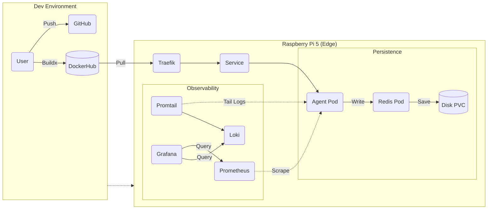

# 🐙 Project Architeuthis: Autonomous Edge Fleet Lab

[](https://github.com/Gael-Troadec/K3s-Pi5-Lab/actions/workflows/docker-build.yml/badge.svg)
[](https://img.shields.io/badge/platform-linux%2Farm64-orange)
[](https://img.shields.io/badge/status-operational-brightgreen)
[](https://img.shields.io/badge/monitoring-prometheus%20%7C%20grafana%20%7C%20loki-blue)

## 📋 About The Project

**Architeuthis** is a personal lab project designed to simulate a fleet of autonomous underwater drones.

As an ex-Military transitioning to DevSecOps, my goal with this project is to build a complete **distributed infrastructure** from scratch. I am moving away from "click-ops" to fully automated, code-driven deployments on constrained hardware (Raspberry Pi 5).

**Core Learnings Achieved:**
* Complete **CI/CD pipeline** (Multi-Arch Buildx -> Docker Hub).
* Orchestration with **Kubernetes (K3s)**.
* **Stateful Architecture** (Data Persistence with PV/PVC).
* **Observability Stack** (Metrics & Logs Visualization).

---

## 📍 Current Progress (Day 19)

I have successfully **COMPLETED Phase IV (Observability)**. The system is now fully monitored.

* ✅ **Hardware Setup:** Raspberry Pi 5 (8GB) configured with OS Lite.
* ✅ **Architecture:** Cross-compiled for ARM64 (using Docker Buildx) to support Edge Hardware.
* ✅ **Orchestration:** K3s Single-node cluster operational.
* ✅ **Persistence:** Redis Data survives Pod deletion (PVC/PV).
* ✅ **Security:** Secrets management implemented (No plain-text passwords).
* ✅ **Monitoring:** Prometheus (Metrics) & Grafana (Dashboards) installed.
* ✅ **Logging:** Loki & Promtail installed for centralized logging.

---

## 🛠️ Technical Architecture

### 📡 Infrastructure Flow (Updated)



### Tech Stack
* **Language:** Python (Flask)
* **Container:** Docker (Multi-Arch AMD64/ARM64)
* **Orchestration:** K3s (Lightweight Kubernetes)
* **Observability:** Prometheus, Grafana, Loki, Promtail
* **Ingress:** Traefik

---

## 🚀 How to Run (Reproduction)

If you want to replicate this setup on a Raspberry Pi, follow these steps:

### 1. Install K3s
First, install the lightweight Kubernetes engine on the Pi:
```bash
curl -sfL [https://get.k3s.io](https://get.k3s.io) | INSTALL_K3S_EXEC="--write-kubeconfig-mode 644" sh -
```

### 2. Deploy the Fleet
Clone the repository and apply the Kubernetes manifests.
*Note: This will deploy the Storage Claims, Secrets, Database, and Application.*

```bash
git clone [https://github.com/Gael-Troadec/K3s-Pi5-Lab.git](https://github.com/Gael-Troadec/K3s-Pi5-Lab.git)
cd K3s-Pi5-Lab

# Apply all manifests
kubectl apply -f manifests/
```

### 3. Access the Dashboard
Map the local domain in your `/etc/hosts`:
```text
192.168.1.XXX   architeuthis.local
```

Then navigate to: **http://architeuthis.local**

### 4. Access Monitoring (Grafana)
Use port-forwarding to access the dashboard:
```bash
kubectl port-forward -n monitoring svc/prometheus-grafana 3000:80
```
Then visit: **http://localhost:3000** (User: `admin`)

---

## 🗺️ Roadmap

| Phase | Focus | Status |
|---|---|---|
| **I. Foundations** | Linux, Docker, CI/CD | ✅ Done |
| **II. Orchestration** | K3s, Ingress, GitOps | ✅ Done |
| **III. Persistence** | Storage, Database, State | ✅ Done |
| **IV. Observability**| Prometheus, Grafana, Loki | ✅ Done |
| **V. Automation** | GitHub Actions Cross-Compile | 🚧 Next Step |
| **VI. Edge AI** | Golang Agents & Tinygrad | ⏳ Planned |

---

*Project maintained by Gael Troadec.*
