# 🐙 Project Architeuthis: Autonomous Edge Fleet Lab

[](https://github.com/Gael-Troadec/K3s-Pi5-Lab/actions/workflows/docker-build.yml/badge.svg)
[](https://github.com/aquasecurity/trivy)
[](https://argoproj.github.io/cd/)
[](https://img.shields.io/badge/platform-linux%2Farm64-blue)

## 📋 About The Project

**Architeuthis** is a personal lab project designed to simulate a fleet of autonomous underwater drones.

As an ex-Military transitioning to DevSecOps, my goal is to demonstrate a **Full-Stack DevSecOps Platform** running on Edge Hardware (Raspberry Pi 5).
The project implements modern DefenseTech standards: **Zero Trust Network**, **Supply Chain Security**, and **GitOps Automation**.

**Core Capabilities:**
* **🏭 Automated Factory:** Multi-Arch CI/CD (AMD64/ARM64) with QEMU.
* **🛡️ Hardened Security:** Automatic Vulnerability Scanning (Trivy) & Internal Firewalls (NetworkPolicies).
* **🧠 GitOps Pilot:** Automated fleet synchronization via **ArgoCD**.
* **👁️ Observability:** Full telemetry stack (Prometheus, Grafana, Loki).

---

## 📍 Current Progress (Day 23)

I have successfully **COMPLETED Phase V (Industrialization)** and started **Phase VII (Edge AI Prototyping)**.

* ✅ **Hardware:** Raspberry Pi 5 (8GB) - OS Lite.
* ✅ **CI/CD:** GitHub Actions pipeline building for ARM64 & AMD64.
* ✅ **Supply Chain:** **Trivy** integration blocking builds with CRITICAL vulnerabilities.
* ✅ **GitOps:** **ArgoCD** managing the cluster state from Git.
* ✅ **Zero Trust:** Redis is isolated via **NetworkPolicies** (only accessible by the App).
* ✅ **Acoustic AI:** Python **Signal Processing** module (FFT/Spectrogram) validated locally. 🆕

---

## 🛠️ Technical Architecture (DevSecOps)

### 📡 The "Factory" Flow (CI/CD + GitOps)

```mermaid
graph LR
    subgraph Factory ["🏭 CI/CD Factory (GitHub)"]
        Code(User Code) --> Build[Build Multi-Arch]
        Build --> Scan{🛡️ Trivy Scan}
        Scan -->|Pass| Reg[(Docker Hub)]
        Scan -->|Fail| Block[❌ Stop Pipeline]
    end

    subgraph Operations ["🧠 GitOps Control"]
        Git(Manifests) <--> ArgoCD(ArgoCD Controller)
    end
    
    subgraph Edge ["⛵ Raspberry Pi (K3s)"]
        ArgoCD -->|Sync| Deploy(Deployment)
        Deploy --> Pod1 & Pod2 & Pod3
        
        subgraph SecureZone ["🛡️ Zero Trust Zone"]
            Redis[(Redis DB)]
        end
        
        Pod1 -->|Allow| Redis
        Hacker[❌ Intruder/Other Pods] -.->|Refused| Redis
    end
    
    Reg -->|Pull Image| Edge
```


## 🧠 Application Module: "ActiveSonar" (Proto-Fourier)

**Status:** ✅ Validated (v0.1 - Local Lab)
**Objective:** Development of the acoustic detection logic (Signal Processing) prior to cluster deployment.

This module acts as the "Brain" of the drone, analyzing audio streams in real-time to detect biological signatures (e.g., Sperm Whales) amidst ocean noise.

### 📂 Code Structure (`/proto-fourier`)

| File | Role | Tech Stack |
| :--- | :--- | :--- |
| `sonar.py` | **Core System:** OOP Class encapsulating the detection logic & state. | Python Class |
| `detector.py` | **Algorithm:** RMS Energy analysis & Thresholding logic. | Librosa, NumPy |
| `visualizer.py` | **Debug:** Generates Spectrograms (Time/Frequency heatmaps). | Matplotlib |
| `generator.py` | **Simulation:** Synthesizes dummy audio data (Noise + Signal). | SciPy |

### 🚀 Quickstart (Local)

```bash
# 1. Generate synthetic ocean data
python proto-fourier/generator.py

# 2. Run the Sonar
python proto-fourier/sonar.py

```

### Tech Stack
* **Language:** Python (Flask) -> *Moving to Golang (Phase VI)*
* **CI/CD:** GitHub Actions + Docker Buildx + QEMU
* **Security:** Aqua Trivy (Scanner) + K8s NetworkPolicies (Firewall)
* **GitOps:** ArgoCD
* **Observability:** Prometheus, Grafana, Loki
* **Orchestration:** K3s

---

## 🚀 How to Run (Reproduction)

### 1. Install K3s & ArgoCD
```bash
# Install K3s
curl -sfL [https://get.k3s.io](https://get.k3s.io) | INSTALL_K3S_EXEC="--write-kubeconfig-mode 644" sh -

# Install ArgoCD
kubectl create namespace argocd
kubectl apply -n argocd -f [https://raw.githubusercontent.com/argoproj/argo-cd/stable/manifests/install.yaml](https://raw.githubusercontent.com/argoproj/argo-cd/stable/manifests/install.yaml)
```

### 2. Deploy via GitOps
You don't need to apply manifests manually anymore. Just tell ArgoCD to watch this repo.

```yaml
# In ArgoCD UI
Source: [https://github.com/Gael-Troadec/K3s-Pi5-Lab.git](https://github.com/Gael-Troadec/K3s-Pi5-Lab.git)
Path: manifests
Destination: [https://kubernetes.default.svc](https://kubernetes.default.svc)
```

### 3. Access The Fleet
* **Application:** http://architeuthis.local (via Traefik Ingress)
* **ArgoCD Console:** https://localhost:8080 (via Port-Forward)
* **Grafana Console:** https://localhost:3000 (via Port-Forward)

---

## 🗺️ Roadmap

| Phase | Focus | Status |
|---|---|---|
| **I. Foundations** | Linux, Docker, Manual CI | ✅ Done |
| **II. Orchestration** | K3s, Ingress, PV/PVC | ✅ Done |
| **III. Observability**| Prometheus, Grafana, Loki | ✅ Done |
| **IV. Security** | Trivy, NetworkPolicies, Secrets | ✅ Done |
| **V. Industrialization**| Multi-Arch CI, ArgoCD (GitOps) | ✅ Done |
| **VI. Performance** | Rewrite Agents in **Golang** | 🚧 Next Step |
| **VII. Edge AI** | Tinygrad Inference & Signal Processing | 🚧 In Progress |

---

*Project maintained by Gael Troadec.*
