# 🐙 Project Architeuthis: Autonomous Edge Fleet Lab


## 📋 About The Project

**Architeuthis** is a personal lab project designed to simulate a fleet of autonomous underwater drones.

As an ex-Military transitioning to DevSecOps, my goal with this project is to build a complete **distributed infrastructure** from scratch. I am moving away from "click-ops" to fully automated, code-driven deployments on constrained hardware (Raspberry Pi 5).

**Core Learnings Achieved:**
* Complete **CI/CD pipeline** (GitHub Actions -> Docker Hub).
* Orchestration with **Kubernetes (K3s)**.
* Implementation of **Data Persistence** (Redis).

---

## 📍 Current Progress (Day 16)

We have successfully **COMPLETED Phase II (Orchestration & Scaling)** and are starting on Persistence.

- [x] **Hardware Setup:** Raspberry Pi 5 (8GB) configured with OS Lite.
- [x] **CI/CD:** Pipeline functional. Commits on `main` trigger a multi-arch build (ARM64/AMD64) via QEMU.
- [x] **Containerization:** Python agents are containerized and optimized.
- [x] **K3s Cluster:** Single-node cluster up and running.
- [x] **Networking:** Service Discovery (NodePort) and Ingress (Traefik) are configured.
- [x] **Scaling & Resilience:** Deployment configured with replicas, self-healing, and load balancing verified.
- [x] **State Separation:** Redis is deployed and connected to the application for persistent state management.
- [ ] **Disk Storage:** Implementation of Persistent Volumes (PVC/PV) for critical data. (Next Focus)
- [ ] **Security:** Hardening and Policies (Planned).

---

## 🛠️ Technical Architecture

### 📡 Infrastructure Flow (Corrected)

```mermaid
graph LR
    subgraph Developer_Zone [💻 Dev Environment]
        User(👱 Gael) -->|Code & Push| GitHub[GitHub Repo]
    end
    subgraph Cloud_CI [☁️ CI / Registry]
        GitHub -->|Trigger| Actions{GitHub Actions / Buildx}
        Actions -->|Push Image| Hub[(Docker Hub)]
    end
    subgraph Edge_Prod [⚓ Raspberry Pi 5]
        Hub -->|Pull Image| K3s[Cluster K3s]
        K3s --> Ingress[Traefik]
        Ingress --> AppSvc[Architeuthis Service]
        AppSvc --> Pods(🦈 Architeuthis Agents)
        Pods --> RedisSvc[Redis Service]
        RedisSvc --> RedisDB[(💾 Redis DB)]
    end
    
    %% Liens entre les zones
    Developer_Zone -.-> Cloud_CI
    Cloud_CI -.-> Edge_Prod
```



### Tech Stack
* **Language:** Python (Flask)
* **Container:** Docker
* **Orchestration:** K3s (Lightweight Kubernetes)
* **Ingress:** Traefik
* **Tools:** VS Code, Git, K9s

---

## 🚀 How to Run (Reproduction)

If you want to replicate this setup on a Raspberry Pi, follow these steps:

### 1. Install K3s
First, install the lightweight Kubernetes engine on the Pi (with user permissions enabled):

```bash
curl -sfL [https://get.k3s.io](https://get.k3s.io) | INSTALL_K3S_EXEC="--write-kubeconfig-mode 644" sh -
```

### 2. Deploy the Fleet

Clone the repository and apply the Kubernetes manifests:

```bash
git clone [https://github.com/Gael-Troadec/K3s-Pi5-Lab.git](https://github.com/Gael-Troadec/K3s-Pi5-Lab.git)
cd K3s-Pi5-Lab
kubectl apply -f manifests/
```

### 3. Access the Dashboard

Since this is a local lab without a real domain name, you need to map the local domain.

Add this line to your local `/etc/hosts` (Linux/Mac) or `C:\Windows\System32\drivers\etc\hosts` (Windows):

```text
192.168.1.XXX   architeuthis.local
```

*(Replace `192.168.1.XXX` with your Raspberry Pi IP address)*

Then open your browser and navigate to: **http://architeuthis.local**

---

## 🗺️ Roadmap

| Phase | Focus | Status |
| :--- | :--- | :--- |
| **I. Foundations** | Linux, Docker, CI/CD | ✅ Done |
| **II. Orchestration** | K3s, Ingress, GitOps | 🔄 In Progress |
| **III. Persistence** | Storage, Database, State | ⏳ Planned |
| **IV. Mutation** | Rewrite in Golang | ⏳ Planned |
| **V. Security** | CKS Prep, Hardening | ⏳ Planned |

---

*Project maintained by Gael Troadec.*
